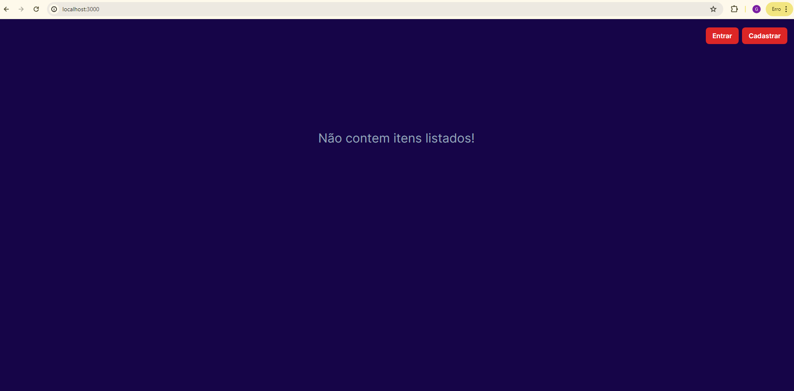
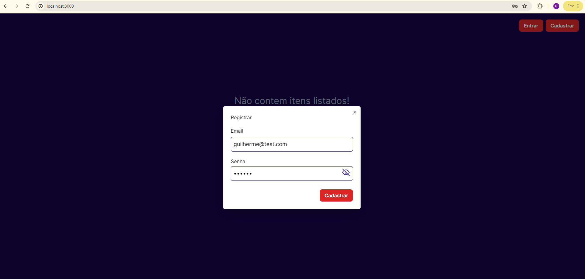
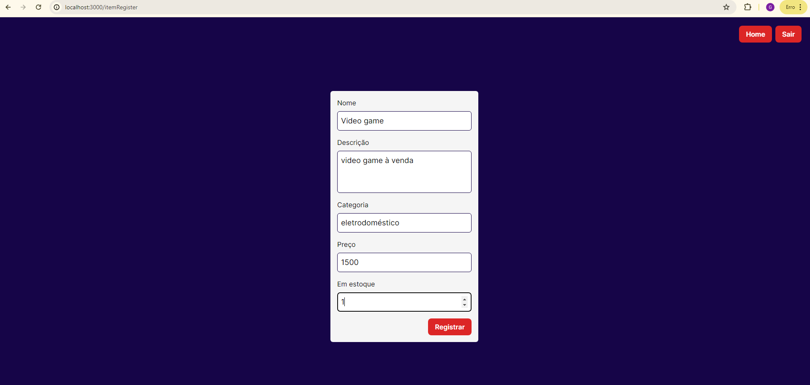
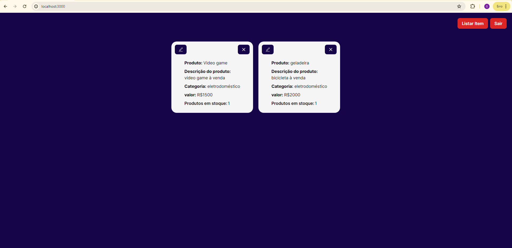
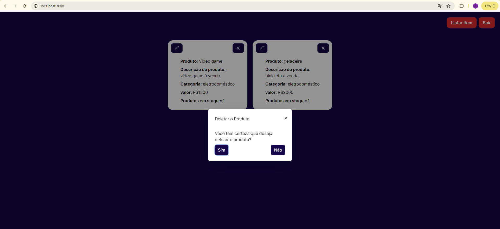
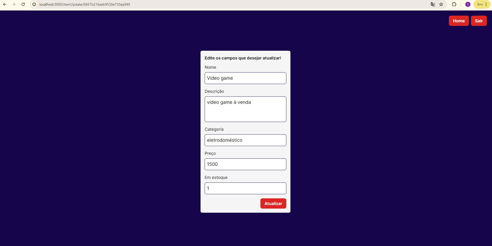
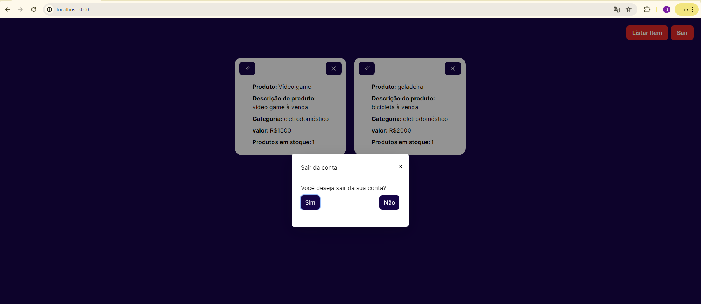

 </div>

## 📃 About

A "Parte 2" do desafio para a vaga de desenvolvedor fullstack web aborda o desenvolvimento da parte front-end com Next.js. Nesta fase, foram implementadas as funcionalidades de paginação, listagem, adição e edição de produtos. Para garantir a segurança e integridade das operações, as ações de deletar ou editar uma postagem só ocorrem se o usuário estiver logado e se o produto foi criado pelo mesmo.

## 🛠 Build with

- [HTML]()
- [CSS]()
- [TypeScript]()
- [Next]()
- [React Query]()
- [Radix]()

## 🎞 Demo

Tela principal sem nenhum produto listado.

Processo de cadastro do usuário.

Processo de criar um produto.

Página principal com todos os produtos criados sendo exibidos

Modal que é aberto quando solicita-se a exclusão de um produto.

Processo de atualização de um produto, em que os valores anteriores são exibidos nos inputes ao entrar na página.

Modal que é aberto quando se solicita sair da conta.


# Processo para executar o programa em sua maquina

### Instale as dependências

```sh
npm i
```

### Inicie a aplicação

```sh
npm run dev
```
